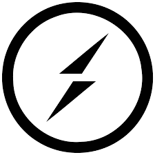
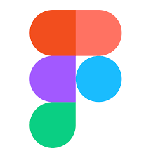

# Hi! I'm Atsuya
### I am Software Developer at<!-- <a href="https://www.jicoo.com/en/about">Jicoo</a> -->

### 🌱 What I’m learning 
I'm learning React, Next.js, and Typescript.

### 📫 How to reach me: tenmusu007@gmail.com, <a href="https://www.linkedin.com/in/atsuya-tanaka-566013229/">Linkedin</a>

### 💬 This is my<!-- <a href="https://portfolio-omega-nine-68.vercel.app/">Portfolio</a> -->

### 🤔 I’m looking for a position as Full stack Developer

## Skill
     

 
